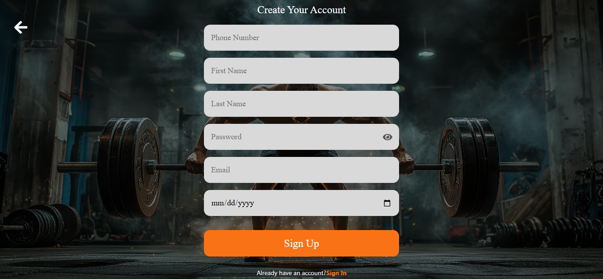

# 🏋️‍♂️ FYP – AI-Powered Gym Management System (Frontend)

A modern React-based frontend for an AI-powered gym management platform that provides personalized workout plans, machine tracking via QR codes, and fitness analytics.

---

## 🚀 Features

- 🎨 **Modern UI/UX**
  Responsive and clean user interface built with React

- 🤖 **AI Integration**
  Interacts with backend to generate personalized workout plans

- 🏷️ **QR Code Interaction**
  View machine details by scanning QR codes

- ❤️ **Favorites System**
  Save and manage preferred categories/subcategories

- 🔐 **Authentication**
  Login system connected to secure backend (JWT)

- 📱 **Responsive Design**
  Works across desktop and mobile devices

---

## 🛠️ Tech Stack

- React.js (Vite)
- Axios
- Tailwind CSS
- React Router
- Context API (state management)

---

## 📂 Project Structure


src/
├── app
├── assets
├── components
├── pages
├── workout
├── api.js
├── config.js
├── App.jsx
├── main.jsx


---

## ⚙️ Installation & Setup

### 🔹 1. Clone the repository

```bash
git clone https://github.com/CharbelWehbe/gym-ai-frontend.git
cd gym-ai-frontend
🔹 2. Install dependencies
npm install
🔹 3. Setup environment variables
cp .env.example .env

Update .env with your backend URL.

🔹 4. Run the app
npm run dev
🔗 Backend Connection

Make sure the backend is running:

http://localhost:8000

Update .env:

VITE_BASE_URL=http://localhost:8000
VITE_BASE_IMAGE_URL=http://localhost:8000/storage

📸 Screenshots

### SignUp Page



To open the project form the mobile phone : 

1- Find your laptop IP address run in the cmd : ipconfig (Looks for IPV4)
2- Run Laravel backend so it's accessible externally , run : php artisan serve --host=0.0.0.0 --port=8000 (in the backend)
3- Run React Vite for network access, run : npm run dev -- --host

4- Update your frontend environment variables In your .env(React): 
VITE_BASE_URL=http://192.168.x.x:8000
VITE_BASE_IMAGE_URL=http://192.168.x.x:8000/storage
Then restart Vite: npm run dev

5- Open this on your phone browser:
http://192.168.X.X:8000 (replace x.x by your IPV4 address)


👥 Contributors

👨‍💻 Charbel Wehbe

👨‍💻 Manuel Mallo


🎯 Future Improvements

📱 Mobile app version (React Native)

🧠 Enhanced AI recommendations

📊 Advanced dashboard analytics

🌐 Deployment to cloud

📄 License

This project is for educational purposes.